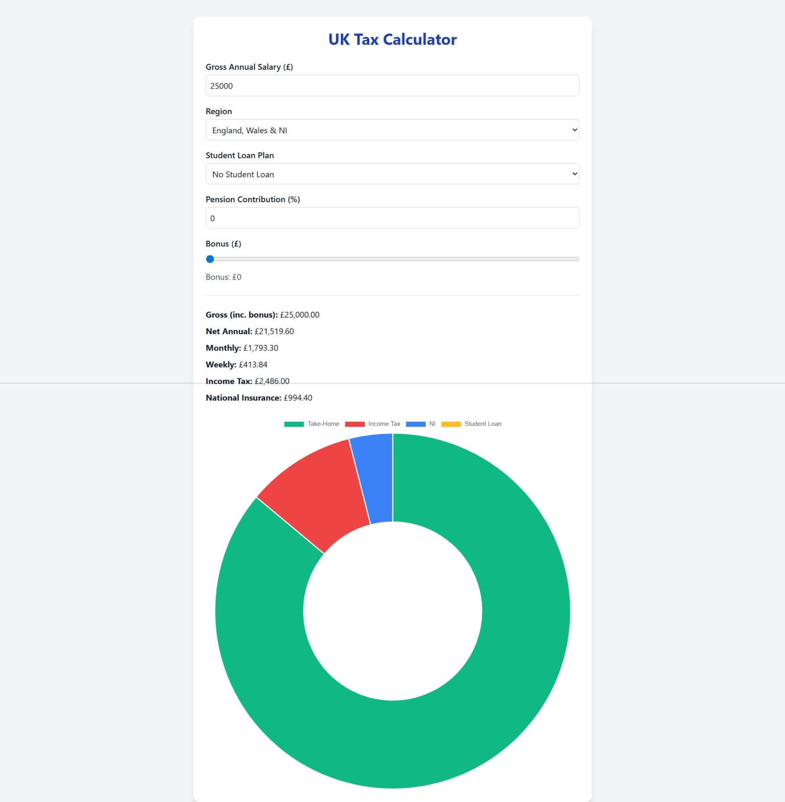

# UK Income Breakdown Calculator

This application is a fast, simple way to break your income down into take home pay, income tax,
national insurance and student loan repayments. All you have to do is enter your salary,
region, student loan plan and optional pension contributions/bonuses, and you will receive a
concise break down of your income, displayed in a list and a handy pie chart!

---

## Features

Simply fill in the form and receive a breakdown of your income, updated in real time as you change the values. This is also downloadable as a PDF!

